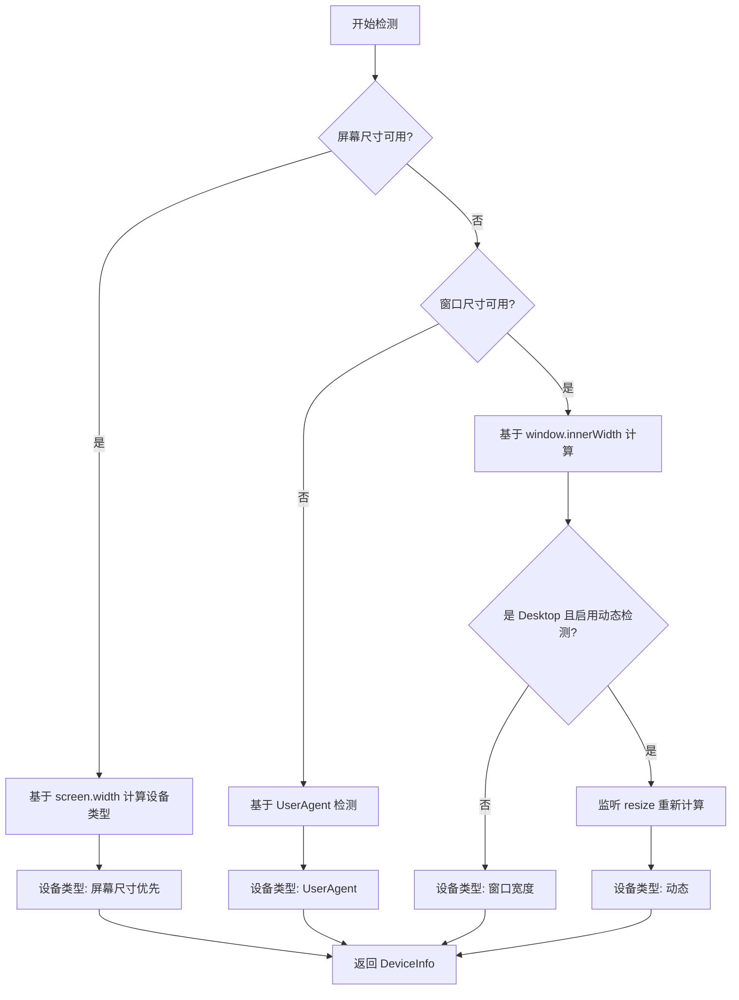

# Device 包优化方案

## 📋 问题分析

根据用户反馈,当前 `@ldesign/device` 包存在以下问题:

### 1. 🔴 无法获取设备分辨率
- 当前 `DeviceInfo` 只获取了 `window.innerWidth/innerHeight` (视口尺寸)
- 缺少 `screen.width/screen.height` (设备实际分辨率)
- 用户无法区分设备物理分辨率和浏览器窗口大小

### 2. 🔴 Desktop 设备类型静态化
- 当前桌面设备的设备类型判断基于初始化时的窗口大小
- 用户调整浏览器窗口大小后,设备类型不会动态更新
- 例如:桌面浏览器从全屏缩小到移动设备尺寸,仍然显示为 `desktop`

### 3. 🔴 缺少优先级机制
- 当前设备类型检测逻辑:基于窗口宽度 `getDeviceTypeByWidth`
- 没有考虑设备实际屏幕尺寸的优先级
- 需要实现:屏幕尺寸计算 > 窗口宽度计算 > UserAgent 检测

## 🎯 优化目标

### 核心目标
1. ✅ **添加屏幕分辨率获取** - 完整的设备物理分辨率信息
2. ✅ **动态设备类型检测** - 窗口大小变化时重新计算设备类型
3. ✅ **优先级检测机制** - 多级检测策略,提高准确性

### 技术目标
- 保持向后兼容,不破坏现有 API
- 优化性能,避免频繁的检测计算
- 提供清晰的 TypeScript 类型定义
- 完善的文档和示例

## 🏗️ 架构设计

### 设备类型检测优先级流程



### 数据结构设计

#### 1. 扩展 DeviceInfo 接口

```typescript
export interface DeviceInfo {
  type: DeviceType
  orientation: Orientation
  width: number        // 视口宽度 (window.innerWidth)
  height: number       // 视口高度 (window.innerHeight)
  pixelRatio: number
  isTouchDevice: boolean
  userAgent: string
  
  // 🆕 新增字段
  screenWidth: number   // 设备屏幕宽度 (screen.width)
  screenHeight: number  // 设备屏幕高度 (screen.height)
  
  os: { name: string, version: string }
  browser: { name: string, version: string }
  
  screen: {
    width: number           // 视口宽度
    height: number          // 视口高度
    pixelRatio: number
    availWidth: number
    availHeight: number
    
    // 🆕 新增字段
    deviceWidth: number    // 设备实际宽度
    deviceHeight: number   // 设备实际高度
  }
  
  features: {
    touch: boolean
    webgl?: boolean
  }
  
  // 🆕 新增字段 - 检测元数据
  detection: {
    method: 'screen' | 'viewport' | 'userAgent'  // 检测方法
    priority: number                              // 检测优先级 (3=screen, 2=viewport, 1=userAgent)
    isDynamic: boolean                            // 是否动态检测
  }
}
```

#### 2. 新增配置选项

```typescript
export interface DeviceDetectorOptions {
  enableResize?: boolean
  enableOrientation?: boolean
  breakpoints?: {
    mobile: number
    tablet: number
  }
  debounceDelay?: number
  modules?: string[]
  debug?: boolean
  
  // 🆕 新增选项
  enableDynamicType?: boolean        // 启用动态设备类型检测 (default: true)
  useScreenSize?: boolean            // 优先使用屏幕尺寸 (default: true)
  screenSizeBreakpoints?: {          // 屏幕尺寸断点
    mobile: number
    tablet: number
  }
}
```

### 核心算法实现

#### 1. 屏幕尺寸获取函数

```typescript
/**
 * 获取设备屏幕尺寸
 */
function getScreenSize(): { width: number, height: number } {
  if (typeof window === 'undefined' || !window.screen) {
    return { width: 0, height: 0 }
  }
  
  return {
    width: window.screen.width || 0,
    height: window.screen.height || 0
  }
}
```

#### 2. 基于屏幕尺寸的设备类型检测

```typescript
/**
 * 根据屏幕尺寸判断设备类型
 * 优先级最高的检测方法
 */
export function getDeviceTypeByScreenSize(
  screenWidth: number,
  breakpoints = { mobile: 768, tablet: 1024 }
): DeviceType | null {
  // 屏幕尺寸无效时返回 null,降级到其他检测方法
  if (!screenWidth || screenWidth === 0) {
    return null
  }
  
  if (screenWidth < breakpoints.mobile) {
    return 'mobile'
  }
  if (screenWidth < breakpoints.tablet) {
    return 'tablet'
  }
  return 'desktop'
}
```

#### 3. 多级检测逻辑

```typescript
/**
 * 综合检测设备类型 (支持优先级)
 */
private detectDeviceType(): {
  type: DeviceType
  method: 'screen' | 'viewport' | 'userAgent'
  priority: number
} {
  const screenSize = getScreenSize()
  const viewportWidth = window.innerWidth
  const breakpoints = this.options.breakpoints || { mobile: 768, tablet: 1024 }
  
  // 优先级 1: 屏幕尺寸 (最准确)
  if (this.options.useScreenSize !== false && screenSize.width > 0) {
    const type = getDeviceTypeByScreenSize(
      screenSize.width,
      this.options.screenSizeBreakpoints || breakpoints
    )
    if (type) {
      return { type, method: 'screen', priority: 3 }
    }
  }
  
  // 优先级 2: 视口宽度 (动态,适合桌面浏览器调整窗口)
  const viewportType = getDeviceTypeByWidth(viewportWidth, breakpoints)
  
  // 对于桌面设备,如果启用了动态检测,使用视口宽度
  if (this.options.enableDynamicType !== false && viewportType === 'desktop') {
    return { type: viewportType, method: 'viewport', priority: 2 }
  }
  
  // 对于移动设备,优先使用屏幕尺寸的判断
  if (screenSize.width > 0 && viewportType !== 'desktop') {
    return { type: viewportType, method: 'viewport', priority: 2 }
  }
  
  // 优先级 3: UserAgent (降级方案)
  if (isMobileDevice()) {
    return { type: 'mobile', method: 'userAgent', priority: 1 }
  }
  
  return { type: 'desktop', method: 'userAgent', priority: 1 }
}
```

## 📝 实施步骤

### 阶段 1: 类型定义更新
- [ ] 更新 `DeviceInfo` 接口,添加 `screenWidth` 和 `screenHeight`
- [ ] 扩展 `screen` 对象,添加 `deviceWidth` 和 `deviceHeight`
- [ ] 添加 `detection` 元数据字段
- [ ] 更新 `DeviceDetectorOptions` 接口

### 阶段 2: 工具函数实现
- [ ] 实现 `getScreenSize()` 函数
- [ ] 实现 `getDeviceTypeByScreenSize()` 函数
- [ ] 更新 `getDeviceTypeByWidth()` 添加动态检测支持

### 阶段 3: 核心逻辑重构
- [ ] 重构 `detectDevice()` 方法
  - 添加屏幕尺寸获取
  - 实现多级检测逻辑
  - 添加检测元数据
- [ ] 更新 `handleDeviceChange()` 方法
  - 支持动态设备类型更新
  - 优化事件触发逻辑

### 阶段 4: 测试与文档
- [ ] 编写单元测试
  - 测试屏幕尺寸获取
  - 测试多级检测逻辑
  - 测试动态类型更新
- [ ] 更新 README 文档
- [ ] 添加使用示例

## 🔍 测试场景

### 场景 1: 移动设备
```typescript
// iPhone 14 Pro
screen.width: 393
window.innerWidth: 393
预期结果: type = 'mobile', method = 'screen', priority = 3
```

### 场景 2: 桌面浏览器全屏
```typescript
// MacBook Pro 16"
screen.width: 1728
window.innerWidth: 1728
预期结果: type = 'desktop', method = 'viewport', priority = 2
```

### 场景 3: 桌面浏览器缩小窗口
```typescript
// MacBook Pro 16" 缩小浏览器窗口
screen.width: 1728
window.innerWidth: 600
预期结果: type = 'mobile', method = 'viewport', priority = 2
// 窗口大小变化时动态更新
```

### 场景 4: 平板设备
```typescript
// iPad Pro 12.9"
screen.width: 1024
window.innerWidth: 1024
预期结果: type = 'desktop', method = 'screen', priority = 3
```

## 📊 性能优化

### 缓存策略
- 屏幕尺寸在整个生命周期中通常不变,只获取一次
- 视口尺寸变化时使用防抖,避免频繁计算
- 检测结果缓存,带过期时间

### 内存优化
- 避免频繁创建对象
- 使用浅拷贝返回 DeviceInfo
- 及时清理事件监听器

## 🎨 API 示例

### 基础使用
```typescript
const detector = new DeviceDetector({
  enableDynamicType: true,  // 启用动态类型检测
  useScreenSize: true,      // 优先使用屏幕尺寸
})

const info = detector.getDeviceInfo()
console.log(info.type)           // 'mobile' | 'tablet' | 'desktop'
console.log(info.screenWidth)    // 设备屏幕宽度
console.log(info.screenHeight)   // 设备屏幕高度
console.log(info.width)          // 视口宽度
console.log(info.detection)      // { method: 'screen', priority: 3, isDynamic: true }
```

### 监听动态变化
```typescript
detector.on('deviceChange', (info) => {
  console.log('设备类型变化:', info.type)
  console.log('检测方法:', info.detection.method)
  console.log('是否动态:', info.detection.isDynamic)
})

// 用户缩小桌面浏览器窗口
// 触发: deviceChange { type: 'mobile', detection: { method: 'viewport', isDynamic: true } }
```

## ✅ 验收标准

1. ✅ 能够正确获取设备屏幕分辨率
2. ✅ 桌面浏览器窗口大小变化时,设备类型能动态更新
3. ✅ 检测优先级正确:屏幕尺寸 > 视口宽度 > UserAgent
4. ✅ 向后兼容,不影响现有功能
5. ✅ 性能无明显下降
6. ✅ 完整的类型定义和文档
7. ✅ 单元测试覆盖率 > 85%

## 🚀 后续增强

### 可选功能
- 支持自定义检测优先级
- 添加设备特征指纹识别
- 支持多显示器场景
- 添加设备方向锁定建议
